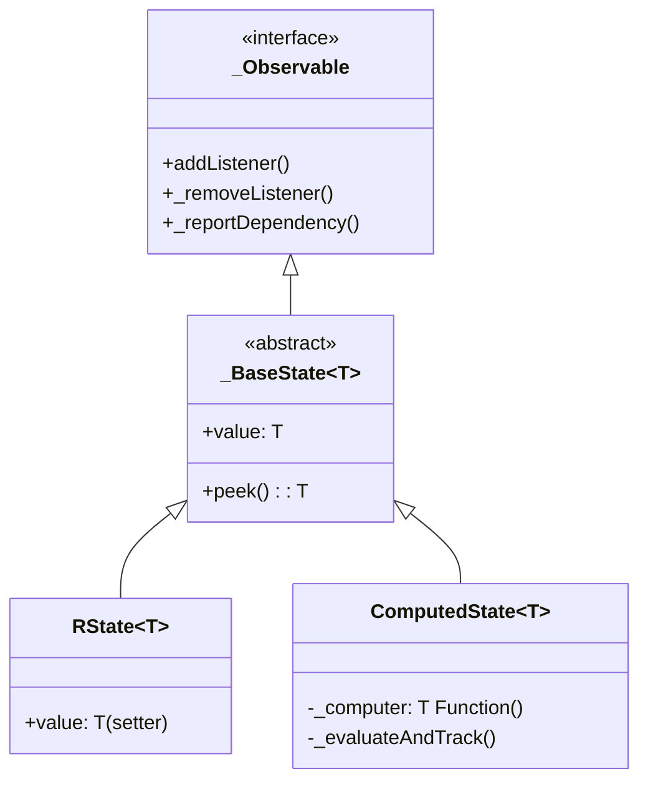

# RState 拆分重构计划：只读与可读写分离 (最终命名版)

该计划旨在重构类层次结构，明确区分“可读写状态源”和“衍生计算状态”。

## 用户评审确认

> [!IMPORTANT]
> **最终命名约定**：
> 1. **`_BaseState<T>`** (私有抽象基类)：封装通用的响应式逻辑、`value` 读取和 `peek()`。
> 2. **`RState<T>`** (公有可读写类)：继承自 `_BaseState`，暴露 `set value`。
> 3. **`ComputedState<T>`** (公有只读类)：继承自 `_BaseState`，负责衍生计算。
> 4. **`_Observable`**：保持为最底层的拓扑契约接口。

## 提议的更改内容

### 核心引擎重构

#### [MODIFY] [core.dart](file:///home/dev/StudioProjects/an_reactive_state/lib/src/core.dart)

1.  **私有基类 `abstract class _BaseState<T> implements _Observable`**:
    *   定义 `T get value`。
    *   定义 `T peek()`。
    *   包含所有共有的成员：`_cachedValue`、`_listeners`、`_isDirty`、`_rootCancellable`、`_equals`、`_activeParentTokens`、`_dependencies` 等。
    *   包含 `addListener`、`_removeListener`、`_reportDependency`、`_notifyOrQueue`、`_directNotifyListeners` 等方法的通用实现。
2.  **可读写类 `class RState<T> extends _BaseState<T>`**:
    *   提供 `set value` 方法。
    *   构造函数接受 `initialValue` 和 `cancellable`。
3.  **计算类 `class ComputedState<T> extends _BaseState<T>`**:
    *   内部持有 `_computer` 闭包。
    *   实现 `_evaluateAndTrack()` 逻辑。
    *   构造函数接受 `computer` 和 `cancellable`。
    *   **只读**，不暴露 setter。

---

### 示例代码适配

#### [MODIFY] [example.dart](file:///home/dev/StudioProjects/an_reactive_state/example/example.dart)

*   `price` 和 `count` 继续使用 `RState`。
*   `totalPrice` 更改为 `ComputedState`。

## 类图预览 (Mermaid)

## 验证计划

### 自动测试
1.  **静态检查**：确认 `ComputedState` 对象没有 `value = ...` 方法。
2.  **功能验证**：确保 `RState` 更新能触发 `ComputedState` 重新计算。

### 手动验证
*   运行 `example/example.dart` 确认控制台输出：
    *   `price.value = 99.0`
    *   `count.value = 1`
    *   `totalPrice.value = 99.0`
    *   修改 `count.value = 3` 后，`totalPrice.value` 变为 `297.0`。
